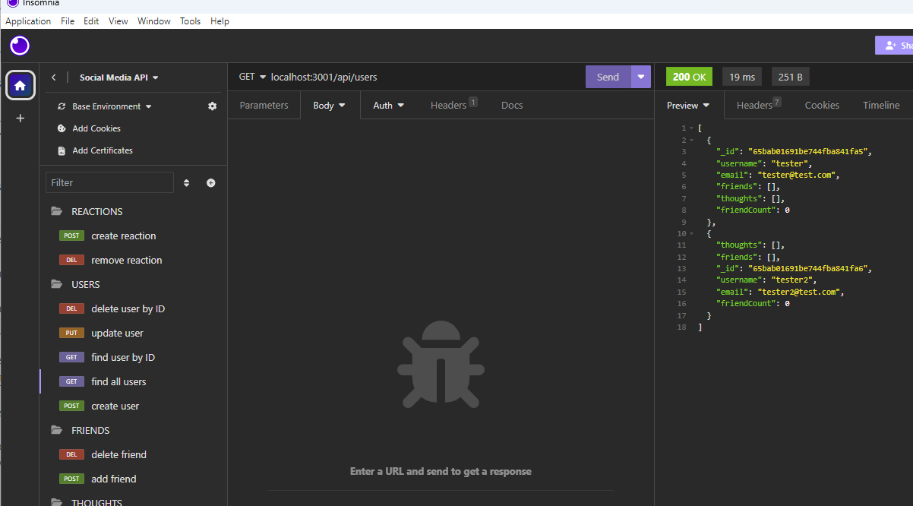

# Social_Media_API-ESchottler

## Description

A social network API using MongoDB database, Mongoose ODM, and Express.js for routing.

## Installation

Start using the api by running 'npm run seed' in the terminal, and start up the API by entering 'run start' in the terminal.

## Usage

View a walkthrough video to see how to use this application: https://drive.google.com/file/d/12p4od29QgGFNBt1zgfuCaYHXd0es1VQI/view

A screenshot of this application in use: 

## Credits

This project was created with the criteria and guidance from UofM-VIRT-FSF-PT-08-2023-U-LOLC.

## License
N/A

